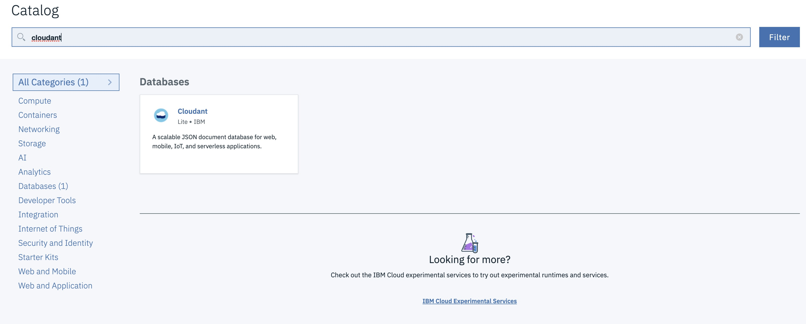
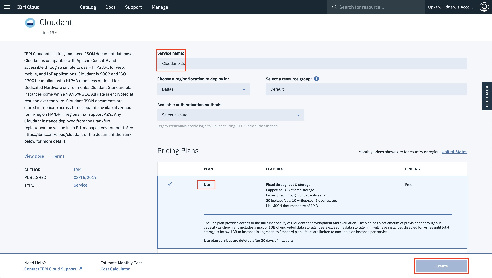
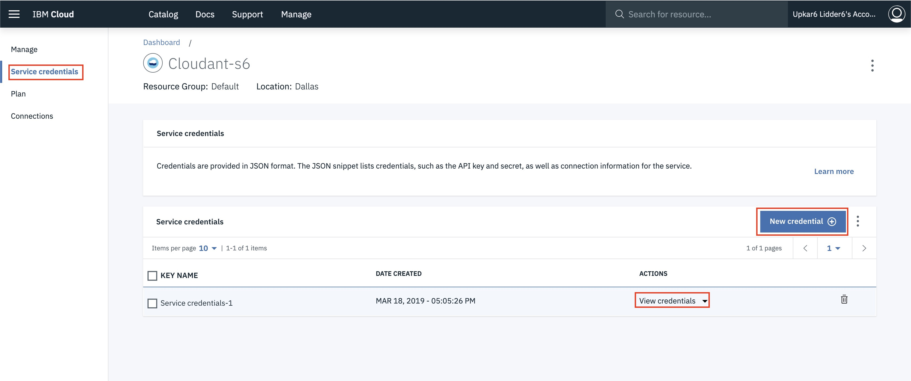

# Serverless APIs with IBM Cloud Functions (powered by Apache OpenWhisk)

This repository was forked from [ibm-cloud-functions-serverless-apis](https://github.com/IBM/ibm-cloud-functions-serverless-apis). I have made a few changes
1. Replaced mySQL with Cloudant as the persistance store.
2. Added an action that uses SendGrid to send an email when a cat with `crimson` color is added to the database.

This project shows how serverless, event-driven architectures can execute code that scales automatically in response to demand from HTTP REST API calls. No resources are consumed until the API endpoints are called. When they are called, resources are provisioned to exactly match the current load needed by each HTTP method independently. Additionally, the project also shows how to use `feeds` and `triggers` to fire `actions` using `rules`.

It shows four IBM Cloud Functions (powered by Apache OpenWhisk) actions (written in JavaScript) that write and read data in a Clouant noSQL database. This demonstrates how actions can work with supporting data services and execute logic in response to HTTP requests.

One action is mapped to HTTP POST requests. It inserts the supplied cat name and color parameters into the database. A second action is mapped to PUT requests to update those fields for an existing cat. A third action is mapped to GET requests that return specific cat data. A fourth action deletes a given cat data.

The Node.js runtime on the IBM Cloud provides a built-in whitelist of npm modules. This demo also highlights how additional Node.js dependencies – such as the SendGrid client – can be packaged in a ZIP file with custom actions to provide a high level of extensibility.


## Included components

- IBM Cloud Functions (powered by Apache OpenWhisk)
- IBM Cloudant

## Prerequisite

You should have a basic understanding of the OpenWhisk programming model. If not, [try the action, trigger, and rule demo first](https://github.com/IBM/openwhisk-action-trigger-rule).

Also, you'll need an IBM Cloud account and the latest [OpenWhisk command line tool (`ibmcloud fn`) installed and on your PATH](https://cloud.ibm.com/docs/cli?topic=cloud-cli-ibmcloud-cli#overview).

As an alternative to this end-to-end example, you might also consider the more [basic "building block" version](https://github.com/IBM/openwhisk-rest-api-trigger) of this sample.

## Steps

1. [Provision Cloudant](#1-provision-cloudant)
2. [Create OpenWhisk actions and mappings](#2-create-openwhisk-actions-and-mappings)
3. [Test API endpoints](#3-test-api-endpoints)
4. [Delete actions and mappings](#4-delete-actions-and-mappings)
5. [Recreate deployment manually](#5-recreate-deployment-manually)

## 1. Provision Cloudant

Log into the IBM Cloud and provision a [Cloudant](https://console.ng.bluemix.net/catalog/services/cleardb-mysql-database/) database instance. Cloudant has a free tier for simple testing.



Provision the lite tier of the Cloudant Service




Copy `local.env.json` to a new file named `env.json` and update the `CLOUDANT_API_KEY`, and `CLOUDANT_URL` for your Cloudant instance. You can get these credentials from the `Cloudant` dashboard as shown here:



## 2. Create OpenWhisk actions and mappings

### Create a package to host our actions

```
wsk package create cat-package -P env.json
```
The -P binds the properties in the `env.json` file at the package level and all the actions inside the package can reference these parameters.
### Create cat-get action

```
wsk action create cat-package/cat-get actions/cat-get-action/index.js --kind nodejs:10
```

The `cat-get` action will be created inside the `cat-package`. We explicitly specify nodejs10 runtime as that has the `@cloudant/cloudant` npm package pre-installed. We can now try this action out by using the `invoke` command.

```
wsk action invoke cat-package/cat-get -r
```

Since we did not pass in any parameters, it just returns the first cat it finds in the database. We can also pass in an id as follows

```
wsk action invoke cat-package/cat-get -p id "35790b1e95675fc7569b7d2d1c5a4e1a" -r
```

### Create cat-delete action
```
wsk action create cat-package/cat-delete actions/cat-delete-action/index.js --kind nodejs:10
```
The action first finds the cat with the provided `id` and then `destroys` the cat.
### Create cat-post action

```
wsk action create cat-package/cat-post actions/cat-post-action/index.js --kind nodejs:10
```
### Create cat-put action

```
wsk action create cat-package/cat-put actions/cat-put-action/index.js --kind nodejs:10
```
### Create API endpoints

```
wsk action update cat-package/cat-get --web true
wsk api create /cats-v1 /cat GET cat-package/cat-get -n 'cat api'
```

```
wsk action update cat-package/cat-delete --web true
wsk api create /cats-v1 /cat DELETE cat-package/cat-delete -n 'cat api'
```

```
wsk action update cat-package/cat-post --web true
wsk api create /cats-v1 /cat POST cat-package/cat-post -n 'cat api'
```


```
wsk action update cat-package/cat-put --web true
wsk api create /cats-v1 /cat PUT cat-package/cat-put -n 'cat api'
```


### bind /whisk.system/cloudant action to personal namespace

```
wsk package bind /whisk.system/cloudant sfhtml5-cloudant-package
```

### bind the cloudant instance to the newly created package so that the credentails are automatically made available

```
ibmcloud fn service bind cloudantnosqldb sfhtml5-cloudant-package --instance Cloudant-s6
```

Show them how to get the servicename from the UI and the command line.
### Create SendGrid Service
<!-- show sendgrid screenshots -->
### Create send-email action
Creat the zip file so that the node_modules are packaged up inside our installable.
```
zip -r sendmail.zip .
```
We can now deploy the zip file to the IBM Cloud Functions.
```
wsk action create cat-package/send_email --kind nodejs:default sendmail.zip -P env.json
```
### create trigger `crimson_cat_trigger` that listens to the **change_action** feed

```
wsk trigger create crimson_cat_trigger --feed sfhtml5-cloudant-package/changes --param dbname cats --param filter "color/crimson-color
```

### create rule that links the `crimson_cat_trigger` trigger with the `send_email` action
```
wsk rule create crimson-cat-rule crimson_cat_trigger cat-package/send_email
```

## 3. Test API endpoints

### Show API calls on postman

There are four helper scripts that simulate HTTP API clients to create, get, update and delete entities against the `/cat-v1/cat` endpoint.

```bash
# POST /cat-v1/cat {"name": "Tarball", "color": "Black"}
client/cat-post.sh Tarball Black

# GET /cat-v1/cat?id=1
client/cat-get.sh 1 # Or whatever integer ID was returned by the command above

# PUT /cat-v1/cat {"id": 1, "name": "Tarball", "color": "Gray"}
client/cat-put.sh 1 Tarball Gray

# DELETE /cat-v1/cat?id=1
client/cat-delete.sh 1
```

**OR USE POSTMAN**

## 4. Delete actions and mappings

Use `deploy.sh` again to tear down the OpenWhisk actions and mappings. You will recreate them step-by-step in the next section.

```bash
./deploy.sh --uninstall
```

## 5. Recreate deployment manually

This section provides a deeper look into what the `deploy.sh` script executes so that you understand how to work with OpenWhisk triggers, actions, rules, and packages in more detail.

### 5.1 Create OpenWhisk actions to modify cat data

Create four actions to manage cat data, one for each method (POST, PUT, GET, and DELETE) of our API. The code for the actions is located in `/actions`. Let's start with the action action that creates a cat record first.

> **Note**: There are a [number of built-in packages ](https://github.com/openwhisk/openwhisk/blob/master/docs/reference.md?cm_mc_uid=33591682128714865890263&cm_mc_sid_50200000=1487347815#javascript-runtime-environments) available in the OpenWhisk Node.js runtime environment. If you need additional packages, you can upload them in a ZIP file along with your action file. More information on the single file versus zipped archive approaches is available in the [getting started guide](https://console.ng.bluemix.net/docs/openwhisk/openwhisk_actions.html#openwhisk_js_packaged_action).

#### 5.1.1 The cat package

Because all of the actions rely on the MySQL database service, it's convenient to set the credentials once at the package level. This makes them available to all the actions in the package so we don't need to define them for each action at creation and run time.

```bash
source local.env
bx wsk package create cat \
  --param "MYSQL_HOSTNAME" $MYSQL_HOSTNAME \
  --param "MYSQL_PORT" $MYSQL_PORT \
  --param "MYSQL_USERNAME" $MYSQL_USERNAME \
  --param "MYSQL_PASSWORD" $MYSQL_PASSWORD \
  --param "MYSQL_DATABASE" $MYSQL_DATABASE
```

#### 5.1.2 The cat create action

The JavaScript code for the POST action is in `/actions/cat-post-action/index.js`. This function depends on the `mysql` client npm package which we need to connect to the database. Install the package using `npm install` (which parses `package.json`) and create a ZIP file that includes both your application and its dependencies.

```bash
cd actions/cat-post-action
npm install
zip -rq action.zip *
```

Next use the OpenWhisk CLI to create an action from `action.zip`.

```bash
# Create
bx wsk action create cat/cat-post \
  --kind nodejs:6 action.zip \
  --web true
```

Then manually invoke the action using the `bx wsk` CLI to test.

```bash
# Test
bx wsk action invoke \
  --blocking \
  --param name Tarball \
  --param color Black \
  cat/cat-post
```

Repeat the steps above to create and test the corresponding GET, PUT, and DELETE actions.

> **Note**: Replace the number 1 in your tests below to reflect the actual id returned from the POST action result above.

#### 5.1.3 The cat read action

```bash
# Create
cd ../../actions/cat-get-action
npm install
zip -rq action.zip *
bx wsk action create cat/cat-get \
  --kind nodejs:6 action.zip \
  --web true

# Test
bx wsk action invoke \
  --blocking \
  --param id 1 \
  cat/cat-get
```

##### 5.1.4 The cat update action

```bash
# Create
cd ../../actions/cat-put-action
npm install
zip -rq action.zip *
bx wsk action create cat/cat-put \
  --kind nodejs:6 action.zip \
  --web true

# Test
bx wsk action invoke \
  --blocking \
  --param name Tarball \
  --param color Gray \
  --param id 1 \
  cat/cat-put

bx wsk action invoke \
  --blocking \
  --param id 1 \
  cat/cat-get
```

#### 5.1.5 The cat delete action

```bash
# Create
cd ../../actions/cat-delete-action
npm install
zip -rq action.zip *
bx wsk action create cat/cat-delete \
  --kind nodejs:6 action.zip \
  --web true

# Test
bx wsk action invoke \
  --blocking \
  --param id 1 \
  cat/cat-delete

bx wsk action invoke \
  --blocking \
  --param id 1 \
  cat/cat-get
```

### 5.2 Create REST API endpoints

Now map a resource endpoint (`/cat`) to the `GET`, `DELETE`, `PUT`, and `POST` HTTP methods, associate them with the corresponding OpenWhisk actions, and use the client scripts to test.

```bash
# Create
bx wsk api create -n "Cats API" /cat-v1 /cat post cat/cat-post
bx wsk api create /cat-v1 /cat put cat/cat-put
bx wsk api create /cat-v1 /cat get cat/cat-get
bx wsk api create /cat-v1 /cat delete cat/cat-delete

# Test

# POST /cat-v1/cat {"name": "Tarball", "color": "Black"}
client/cat-post.sh Tarball Black

# GET /cat-v1/cat?id=1
client/cat-get.sh 1 # Replace 1 with the id returned from the POST action above

# PUT /cat-v1/cat {"id": 1, "name": "Tarball", "color": "Gray"}
client/cat-put.sh 1 Tarball Gray

# DELETE /cat-v1/cat?id=1
client/cat-delete.sh 1
```

### 5.3 Clean up

Remove the API mappings and delete the actions.

```bash
bx wsk api delete /cat-v1
bx wsk action delete cat/cat-post
bx wsk action delete cat/cat-put
bx wsk action delete cat/cat-get
bx wsk action delete cat/cat-delete
bx wsk package delete cat
```

## Troubleshooting

Check for errors first in the OpenWhisk activation log. Tail the log on the command line with `bx wsk activation poll` or drill into details visually with the [monitoring console on the IBM Cloud](https://console.ng.bluemix.net/openwhisk/dashboard).

If the error is not immediately obvious, make sure you have the [latest version of the `bx wsk` CLI installed](https://console.ng.bluemix.net/openwhisk/learn/cli). If it's older than a few weeks, download an update.

```bash
bx wsk property get --cliversion
```

## Alternative deployment methods

`deploy.sh` will be replaced with [`wskdeploy`](https://github.com/openwhisk/openwhisk-wskdeploy) in the future. `wskdeploy` uses a manifest to deploy declared triggers, actions, and rules to OpenWhisk.

You can also use the following button to clone a copy of this repository and deploy to the IBM Cloud as part of a DevOps toolchain. Supply your OpenWhisk and MySQL credentials under the Delivery Pipeline icon, click `Create`, then run the Deploy stage for the Delivery Pipeline.

[](https://bluemix.net/deploy?repository=https://github.com/IBM/openwhisk-serverless-apis.git)

## License

[Apache 2.0](LICENSE.txt)
